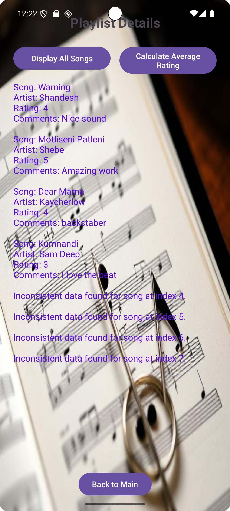
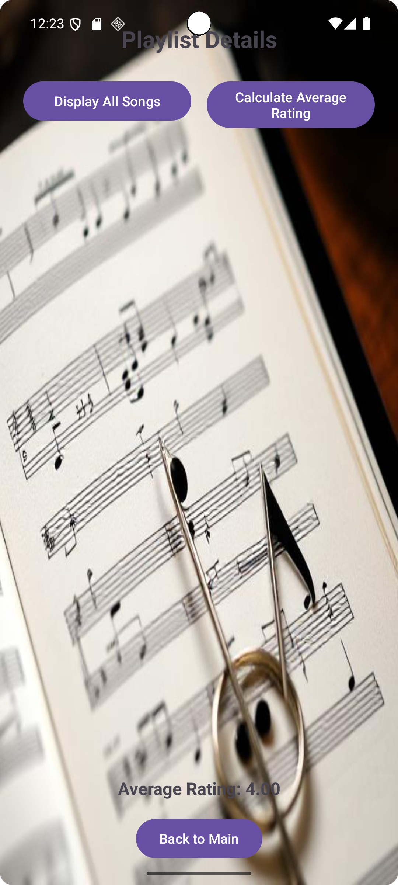

# Management-System

Date:19 June 2025
Name: Mokete Mantjne
Student Nr.: ST10495452

Brief overview:
This music playlist management app built with Android and Kotlin allows users to add songs with details like artist, rating, and comments. Users can then view their complete playlist or see the average rating of all added songs.

Repository link:
https://github.com/Gadaffi-24/Management-System.git

Screenshots with descriptions:
1..png>)
This Android manifest configures a music playlist management app with a main activity and a view screen.

2..png>) 
This Kotlin code defines the ViewScreen activity for a music playlist app. It retrieves and displays song titles, artists, ratings and comments passed from a previous screen. Users can view the full playlist or calculate and display the average song rating with error handling included.

3..png>) 
This layout designs the ViewScreen for a music playlist app featuring a title buttons to display all songs or calculate average rating scrollable text views for output and a back button to return to the main screen.

4..png>) 
This layout designs the main activity for a music playlist app. It includes an image input fields for song title, artist, rating, and comments and buttons to add songs view the playlist or exit the application.

5..png>)
This Kotlin code defines the MainActivity for a music playlist app. It allows users to add new songs with titles, artists, ratings (1-5) and comments performing input validation. The app can then view all added songs on a separate screen or exit the application.

[Title](<../../../../../the app in progress.webm>)

Screenshots of the App running on the emulator:

 

